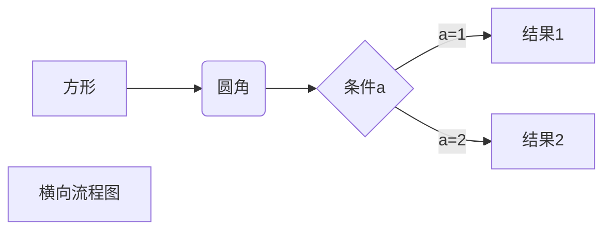
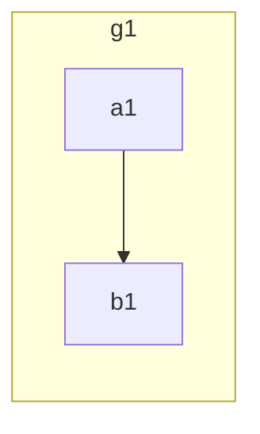

[TOC]

# 正文
## 大纲

1. 基本语法

   1.1 变量

   1.2 选择，循环

   1.3 指针，数组，容器

2. 面向接口

   2.1 结构体

   2.2 duck typing的概念

   2.3 组合的思想

3. 函数式编程

   3.1 闭包的概念

4. 工程化

   4.1 资源管理、错误处理

   4.2 测试和文档

   4.3 性能调优

5. 并发编程

   5.1 goroutine、channel

   5.2 调度器

6. 项目：
 单体-》并发-》分布式

### 一、 基本语法

#### 1. 变量variable

##### 1.1 变量类型

- 整型：(u)int[8/16/32/64],  uintptr

- bool string

- byte rune(golang中的char)

- 浮点型：float[32/64]

- 复数：complex[64/128]  $ i = \sqrt{-1} $
  
  $\left|3+4i \right| = \sqrt{3^2+4^2} = 5 $
  
  $ i^2 = -1,i^3 = -i,i^4 = 1,... $

##### 1.2 类型转换

只有强制类型转换，没有隐式转换

- 


#### 2. 选择，判断，循环

if, 在判断之前，可以后接变量定义语句

没有while

switch/case，和java相反，每一项会自动break，除非使用fallthrough

#### 3. 指针，数组，容器

##### 3.1 函数function

- 返回值类型 在后面
- 返回多个值
- 函数作为参数传递
- 可选参数列表

##### 3.2 指针 point

- 函数参数传递：

  值传递 & 引用传递

  golang在定义类型的时候，就要考虑要作为指针用还是值用

  Go 所有的传递，都是值传递

- *，&

  类型前面*，代表某类型的指针

  变量前面*，代表某变量的“真值”
  
  变量前面&，代表某变量的地址

##### 3.3 容器

###### 3.3.1 数组

- 定义

  ```
  var arr [5]int
  arr := [3]int{1,2,3}
  arr := [...]int{3,4,5}
  var grid [4][5]int
  ```
  
- 传值类型：值类型，和其他不同

- [10]int 和 [20]int 是不同类型

- 调用func f(arr [10]int) 会<u>***拷贝***</u>数组

###### 3.3.2 slice

- slice本身并没有数据，是对底层array的一个view

- 左闭，右开

	```
	arr := [...]int{0,1,2,3,4,5,6,7,8,9}
	slice1 := arr[2:6]
	// s是arr的一个view(视窗)，相当于指针
	slice2 := s1[3:5]
	```
	
	s1显示：2，3，4，5
	
	s2显示：5，6      	// 此处涉及slice的长度与容量，长度之外容量之内暂且称为阴影部分

- array转换slice：``` slice := arrar[:]```

- slice可以向后扩展，不可以向前扩展。
- s[i] 不可以超越len[s]，向后扩展不可以超过底层原生数组cap(s)


- 添加元素时如果超越cap，系统会重新分配更大的底层数组

- 由于值传递的关系，必须接收append的返回值

  ```  s = append(s,val) ```

- 注意：底版数组取view的slice，更改slice也会更改底版arr

  ​		   slice使用append扩容之后，更改slice不会影响原底版

``` go
slice := make([]int,长度,容量)
copy(s2,slice) 	// 拷贝值
```


###### 3.3.3 Map

```
m := map[string]string {
		"name":"aaa",
		"course":"golang",
		"site":"imooe",
		"quality":"haha", 
}

m2 := make(map[string]int)

var m3 map[string]int
```

- 创建 make(map[string]int)

- 获取元素 m[key]

- key不存在时，获的value类型的初始值

- 用value,ok := map[key] 判断是否存在key

- 删除元素，delete()

- 遍历：range , 或者for

- len() 获取元素个数

- map 的 key

  - map 使用哈希表，必须可以比较像等

  	- 除了slice, map, function 的内件类型都可以做为key
  	- Struct 类型不包含商数字段，也可以作为key

###### 3.3.4 rune

- 使用    `utf8.RuneCountInString`    获取字符数量
- 使用    len  获取字节(长度)数量
- 使用    []byte    获取字节切片
- 常规字符串操作
  - Fields(空格分割)    Split    Join
  - Contains    Index 
  - ToLower    ToUpper
  - Trim    TrimRight    TrimLeft

### 二、 面向接口

#### 1. 面向对象(OOP)

Object Oriented Programming

1.1 特性

​		1.1.1 Go语言仅支持封装，不支持继承与多态

​		1.1.2 Go语言没有class，只有struct

1.2 struct结构体的定义

```
// declarat struct 声明/定义 结构体
type treeNode struct {
	value int
	left, right *treeNode
}
func struct_demo() {
	// 实例化结构体 init struct
	var root treeNode

	root = treeNode{value: 3}
	root.left = &treeNode{}
	root.right = &treeNode{5,nil,nil}
	root.right.left = new(treeNode)

	nodes := []treeNode{
		{value:3},
		{},
		{6,nil,&root},
	}
	fmt.Println(nodes)
}
```

- 不论地址还是结构本身，尽皆使用  .  访问成员

```
func factoryNode(i int) *treeNode {
	return &treeNode{value:i}
	/* 附：此处返回的是局部变量的地址给函数外界，
	在CPP中是典型常见错误，但是golang中允许这样传递
	*/
}
```

- 使用自定义工厂函数

- 注意返回了局部变量的地址

- 结构常见在堆上还是栈上？

	- CPP ：函数内部的放在栈上，函数结束后就销毁。

					函数外部的放在堆上，需要手动才能销毁。
	
- java：函数内销毁。函数外放在堆上，由java GC回收
  
  - golang：根据是否取地址给外界决定
  
       

- 专属函数

  1. 显式定义， 命名方法接受者

     ```
     // treeNode 的专属函数
     func (x *treeNode) setValue(i int) {
     	// 因为go只有值传递，所以要改变结构体内容，只能使用指针
     	x.value = i
     }
     ```

     

  2. 调用专属函数的时候，无论 地址指针 or 变量名称 ，聪明的编译器都可以转换为符合函数要求的状态调用专属函数。

  3.  nil 空针，可以  .  专属函数，但是无法  .  成员

  4. 值接收  vs  指针接收

     - 修改内容，必须指针
  - 结构过大，优先指针
    
     - 一致性，若有指针接收这，最好一致
  - ***值接收***  go语言特有
    
    - java ： this关键字，引用
      
       - cpp ： this关键字，指针
    - python： self关键字，指针
     - 值接收 / 指针接收，均可混用接收(address / name)
    
     
    
  

#### 2. 包 & 封装

##### 封装

- 

  - 首字母大写 -> public, 小写 -> private
  - 每个目录一个包
  - main包 包含可执行入口
  - 为结构定义的方法必须放在同一个包内，可以是不同文件
- 如何扩充？ 系统类型 or 别人的类型
  - 定义别名 封装 `type a []string`
  - 使用组合 模拟 继承 `type z_stu struct{stu *student}`

##### GOPATH

。。。

#### 3. 接口

常用的系统接口:

Stringer/Reader/Writer

##### 3.1 duck typing

- > The name comes from the phrase:
  >
  >  "If it looks like a duck and quacks like a duck, it's a duck".

描述事物的外部行为，而非内部结构

严格说，Go语言属于结构化类型系统，类似duck typing

- 

  - Python 中 duck typing

    ``` python
    def download(retriever):
    		return retriever.get("www.imooc.com")
    ```

    1. 运行时才知道传入的retriever有没有get
    2. 需要注释来说明接口

  - CPP 中 duck typing

    ```c++
    template <class R>
    string download(const R& retriever) {
      return retriever.get("www.imooc.com");
    }
    ```

    1. 编译时才知道传入的retriever有没有get
    2. 需要注释类说明接口

  - JAVA中，类似duck typing

    ```java
    <R extends Retriever>
    String download(R r) {
      return r.get("www.imooc.com");
    }
    ```

    1. 传入的参数必须实现Retriever接口
    2. 不是duck typing

  - golang 的duck typing

    思考：同时需要Readable, Appendable怎么办？

    1. 同时具有Python，CPP 的duck typing的灵活性
    2. 又具有java的类型检查

- 接口的定义

  - go 的接口，由** 使用者 **来定义。(不同于传统面向对象)
		```mermaid
		graph LR
		A(使用者 download) -->B(实现着 retriever)
		```

- 
  - 接口的实现是隐式的
  - 只要实现接口里的方法


##### 3.2 接口的实现 implement interface

- A结构实现B接口中所有的方法，及认定为implement。

- 当A结构的方法的接受者为*p时，则为这个结构的指针实现了接口，使用时只能用指针类型

- interface 的肚子里，有两个东西，一个是类型type，一个是值value

  ```mermaid
  graph LR
    subgraph 接口变量
      实现者的类型 -.- 实现者的指针
    end
    实现者
    实现者的指针 --> 实现者
  
  ```

  

- 查看interface的类型，两个方法：

  - ```
    switch v := r.(type) {
    case mock.HHRetriever:
    		fmt...
    case real.RRetriever:
    		fmt...
    }
    ```

  - ```
    if mockRetriever, ok := r.(mock.RRetriever);ok{
    fmt..
    } else {
    fmt..
    }
    ```

  - 表示任何类型：``` interface{}```

- 接口变量自带指针

- 接口变量同样采用值传递，几乎不需要使用指针

- 指针接收者实现只能以指针方式使用；值接收者都可


##### 3.3 接口的组合

```go
type Retriever interface{
	Get()
}
type Poster interface {
  Post(s string) string
}
type Session interface {
  Retriever
  Poster
}
```

当A结构同时具有Get（）和Post（）方法时，A结构即实现了以上3个接口


### 三、 函数式编程

#### 1. 函数 & 闭包

##### 1.1 函数式编程 vs 函数指针

- 函数是一等公民：参数，变量，返回值都可以是函数
- 高阶函数
- 函数 -> 闭包
- "正统"函数式编程
  - 不可变性：不能有状态，只有常量和函数
  - 函数只能有一个参数


```go
type iAdder func(int) (int,iAdder) 	//返回加完的值，和下一个函数

func adder2(basic int) iAdder  {
	return func(v int) (int, iAdder) {
		return basic+v,adder2(basic+v)
	}
}
func demo()  {
	add2 := adder2(0)
	for i := 0; i < 10; i++ {
		var sum int
		sum, add2 = add2(i)
		fmt.Println(i, sum)
	}
}
```


`

`


`


`


`

### 四、 工程化

### 五、 并发编程

### 六、 吐槽 & 注意

####  吐槽


1. 类型在名字后面，导致程序员往往先写了类型，再把光标移到前面，写名称。反程序员的设计。
2. 函数的接收者，使用起来其实和普通函数里面加一个参数是一样的。区别在于，使用权限。既然只是为了区别使用权限，结构体的专属函数应该写在结构体里面，为什么要写在外面呢？影响观瞻，影响阅读。


#### 注意

- append( ) 改变了slice的len,cap，原本slice可以到处当view真实值来用，但是append( )之后，成了另一个新的slice，就sli在原处不受影响 


# 附录
### 快捷键
##### Typora

显示源码 		cmd  / 
侧边栏 			Shift cmd L 
有序列表 		opt cmd o
无序列表 		opt cmd u
任务列表 		opt cmd x
加粗				 cmd b
倾斜				 cmd i
下划				 cmd u
清除样式		 cmd  \

##### IDEA

###### 快捷键

快速纠正		opt return

自动赋值		variable ：cmd opt V 或.var

文档速览		quick documentation F1 或 ctrl+J 或 ctrl + 滚轮(button2)

###### LiveTemplates

这真的是个好东西，可以自定义缩写

：，err，for, forr....

比如自定义一个ff `fmt.Println($VAR$)$END$`，再Edit variables和choose


##### Postfix Completion

这真的是个好东西，是语句之后 + . 指令

比如自定义一个.f    `fmt.Println($EXPR$)$END$`

则`"hello".f` 自动为 `fmt.Println("hello")`


### Markdown 语法

##### LaTex

$\alpha \in A$		$\sqrt{2}$		$[w]$		$\left| 3 \right|$

##### mermaid







.

.

.

.

.

.

.

.

.

.

### fmt包Printf


- <font color=#2F4F4F size=5>General 常规/常用</font>
  - `%v` 以默认的方式打印变量的值
	- `%T` 打印变量的类型
	- `%q` 单引号围绕的字符字面值，由go语法安全的转义，UTF-8和Unicode转char
	- `%X` 大写的十六进制


- <font color=#2F4F4F size=5>Integer</font>
	- `%+d` 带符号的整型，`fmt.Printf("%+d", 255)`输出`+255`
	- `%q` 打印单引号
	- `%o` 不带零的八进制
	- `%#o` 带零的八进制
	- `%x` 小写的十六进制
	- `%X` 大写的十六进制
	- `%#x` 带0x的十六进制
	- `%U` 打印Unicode字符
	- `%#U` 打印带字符的Unicode
	- `%b` 打印整型的二进制


- <font color=#2F4F4F size=5>Integer width</font>
	- `%5d` 表示该整型最大长度是5，下面这段代码
		```
		fmt.Printf("|%5d|", 1)
		fmt.Printf("|%5d|", 1234567)
		```
		输出结果如下：
		```
		|    1|
		|1234567| 
		// %-5d 则相反，打印结果会自动左对齐
		// %05d 会在数字前面补零。
		```
- <font color=#2F4F4F size=5>Float</font>
	- `%f` (=`%.6f`) 6位小数点
	- `%e` (=`%.6e`) 6位小数点（科学计数法）
	- `%g` 用最少的数字来表示
	- `%.3g` 最多3位**数字**来表示
	- `%.3f` 最多3位**小数**来表示


- <font color=#2F4F4F size=5>String</font>
	- `%s` 正常输出字符串
	- `%q` 字符串带双引号，字符串中的引号带转义符
	- `%#q` 字符串带反引号，如果字符串内有反引号，就用双引号代替
	- `%x` 将字符串转换为小写的16进制格式
	- `%X` 将字符串转换为大写的16进制格式
	- `% x` 带空格的16进制格式


- <font color=#2F4F4F size=5>String Width</font>
	- `%5s` 最小宽度为5
	- `%-5s` 最小宽度为5（左对齐）
	- `%.5s` 最大宽度为5
	- `%5.7s` 最小宽度为5，最大宽度为7
	- `%-5.7s` 最小宽度为5，最大宽度为7（左对齐）
	- `%5.3s` 如果宽度大于3，则截断
	- `%05s` 如果宽度小于5，就会在字符串前面补零


- <font color=#2F4F4F size=5>Struct</font>
	- `%v` 正常打印。比如：`{sam {12345 67890}}`
	- `%+v` 带字段名称。比如：`{name:sam phone:{mobile:12345 office:67890}`
	- `%#v` 用Go的语法打印。
   比如`main.People{name:”sam”, phone:main.Phone{mobile:”12345”, office:”67890”}}`


- <font color=#2F4F4F size=5>Boolean</font>
	- `%t` 打印true或false


- <font color=#2F4F4F size=5>Pointer</font>
	- `%p` 带0x的指针
	- `%#p` 不带0x的指针

作者：gowk
链接：https://www.jianshu.com/p/8be8d36e779c


# 草稿
### 项目结构

- yanlib
  - kasaya
    - go ja cv kg nlp bc note


